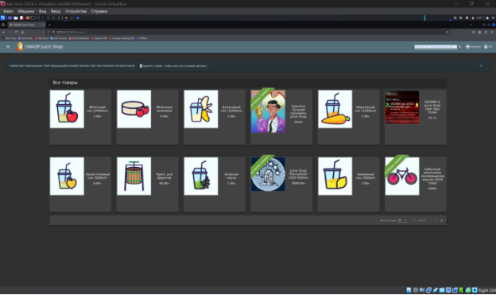
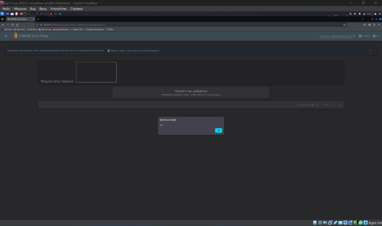
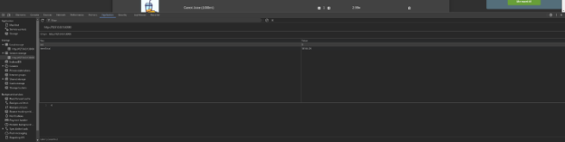
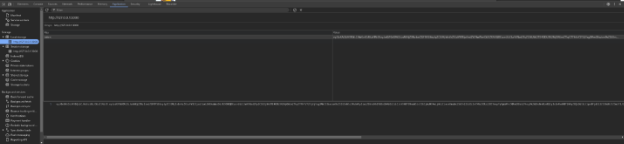
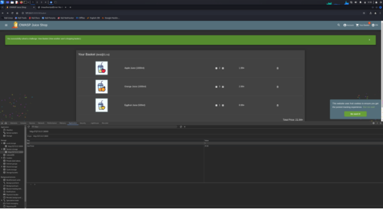

Вписываем в поиск xss

<iframe src="javascript:alert('xss')">

Получаем

Задание 2

1 изображ

**Session Storage** записаны два ключа:

- bid: значение 6.
- itemTotal: значение 18166.01.

bid, скорее всего, представляет идентификатор корзины (basket ID), а itemTotal — общую сумму товаров в корзине.

2е изобр 

В **Local Storage** находится ключ token, который содержит длинную строку, похожую на JSON Web Token (JWT). Токен, скорее всего, связан с авторизацией пользователя.

Попытка найти IDOR

Тк на 1ом изображение у нас есть bid, который имеет значение 6, попробуем его изменить

Меняем с 6 на 1 и обновляем страницу

